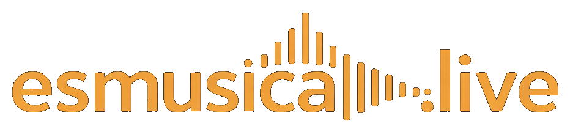

<p align="center">
  
</p>

<h1 align="center">esmusica.live</h1>

<p align="center">
  <strong>The live-music marketplace for private events in El Salvador and Guatemala.</strong><br/>
  Book verified musicians for weddings, quinceañeras, anniversaries, and corporate events.
</p>

<p align="center">
  <a href="https://nextjs.org"></a>
  <a href="https://www.typescriptlang.org"></a>
  <a href="https://www.prisma.io"></a>
  <a href="https://tailwindcss.com"></a>
  <a href="https://vercel.com"></a>
</p>

---

## Overview

esmusica.live connects event organizers with live musicians and bands for hire. Clients search by genre, location, and budget, watch real performance videos, and book securely — the musician only gets paid once the event is done. Musicians list their services for free and keep 97% of what they charge.

Think Airbnb for live music: simple discovery, protected payments, and zero upfront commitment for either side.

---

## Features

### Done

- **Landing page** — hero section, intelligent search bar, genre chips (Jazz, Cumbia, Salsa, Marimba, Pop, Rock), featured musicians grid, and waitlist capture
- **Database schema** — 14 Prisma models covering the full domain: users, musician profiles, services, videos, bookings, booking status logs, messages, reviews, waitlist, and analytics events
- **Authentication** — Auth.js v5 with Google OAuth and email/password credentials, bcrypt hashing, Prisma session adapter
- **Waitlist API** — `POST /api/waitlist` stores leads with optional search query context
- **Fee calculation** — all booking amounts (service price, 14% booking fee, 3% musician fee, Wompi cut, platform net) computed and stored at booking creation time

### In progress

- Musician onboarding flow (5-step wizard: profile, genres/instruments, services, videos, publish)
- Booking flow + Wompi payment integration
- Musician dashboard (calendar, bookings, earnings)
- Client dashboard (upcoming events, booking history)
- Search backed by real database with filters

### Planned

- Cloudflare Stream video upload and playback on musician profiles
- Real-time messaging per booking
- Dispute resolution workflow
- Pro and Studio subscription tiers for musicians
- Expansion to Mexico, Colombia, and the rest of Latin America

---

## Tech Stack

| Layer | Technology | Why |
|---|---|---|
| Framework | Next.js 14 App Router | Server components, file-based routing, Vercel-native |
| Language | TypeScript 5 | Type safety across the full stack |
| Database | PostgreSQL + Prisma v7 | Relational integrity for bookings and payments |
| ORM adapter | `@prisma/adapter-pg` | Native pg driver, no ORM overhead |
| Connection pooling | Prisma Accelerate (optional) | Serverless-safe connection pooling on Vercel |
| Auth | Auth.js v5 + `@auth/prisma-adapter` | Google OAuth and credentials, zero-config sessions |
| Payments | Wompi | Preferred payment processor in El Salvador |
| Video | Cloudflare Stream | Affordable HLS streaming for musician demo videos |
| File storage | Cloudflare R2 | S3-compatible photo storage with no egress fees |
| Email | Resend | Transactional emails (booking confirmations, alerts) |
| i18n | next-intl 4 | Spanish-first, multi-locale ready |
| Styling | Tailwind CSS 3 | Utility-first, dark-mode design system |
| Hosting | Vercel | Edge-ready, zero-config Next.js deployments |

---

## Getting Started

### Prerequisites

- Node.js 18+
- A PostgreSQL database (we recommend [Neon](https://neon.tech) or [Supabase](https://supabase.com) for serverless)
- A Google Cloud project with OAuth credentials (for Google login)

### 1. Clone and install

```bash
git clone https://github.com/chrismoreira/esmusica-live
cd esmusica-live
npm install
```

### 2. Configure environment variables

```bash
cp .env.example .env.local
# Open .env.local and fill in at minimum:
#   DATABASE_URL, DIRECT_URL, NEXTAUTH_SECRET, GOOGLE_CLIENT_ID, GOOGLE_CLIENT_SECRET
```

### 3. Set up the database

```bash
# Run migrations and generate the Prisma client
npx prisma migrate dev --name init
npx prisma generate
```

### 4. Start the dev server

```bash
npm run dev
# Open http://localhost:3000
```

---

## Business Model

esmusica.live uses a split-fee model similar to Airbnb: the platform earns from both sides of each transaction while keeping fees transparent.

```
Musician lists service at:   $100.00
Client pays (+ 14% fee):     $114.00
Wompi processing (5.27%):  -  $6.01
───────────────────────────────────
Platform net revenue:         $10.99
Musician receives:            $97.00
```

- **Client booking fee:** 14% added on top of the musician's listed price
- **Musician service fee:** 3% deducted from the musician's listed price
- **Payment processor:** Wompi at ~5.27% effective rate (El Salvador)
- Musician payout is held until the event is marked complete — funds never leave escrow early

All fee fields (`serviceAmount`, `bookingFee`, `clientTotal`, `musicianPayout`, `platformFee`, `wompiFeePaid`) are computed once at booking creation and stored directly on the `Booking` record for immutable audit trails.

---

## Project Structure

```
esmusica-live/
├── app/
│   ├── page.tsx                    # Landing page (hero, search, waitlist)
│   ├── layout.tsx                  # Root layout — fonts, metadata, global CSS
│   ├── globals.css                 # CSS custom properties (design tokens)
│   └── api/
│       ├── auth/[...nextauth]/     # Auth.js v5 catch-all route
│       └── waitlist/               # POST /api/waitlist — lead capture
├── components/
│   ├── SearchBar.tsx               # Search with genre/location/budget filters
│   └── WaitlistForm.tsx            # Email capture form
├── lib/
│   ├── auth.ts                     # Auth.js v5 config (providers, adapter)
│   └── prisma.ts                   # PrismaClient singleton (pg adapter)
├── prisma/
│   └── schema.prisma               # Full DB schema — 14 models, enums, indexes
├── prisma.config.ts                # Prisma v7 datasource config (DIRECT_URL)
├── public/
│   └── logo.png                    # esmusica.live wordmark
├── .env.example                    # All required environment variables
└── tailwind.config.ts              # Tailwind + custom font setup
```

---

## Environment Variables

Copy `.env.example` to `.env.local` and fill in the values below.

| Variable | Required | Description |
|---|---|---|
| `DATABASE_URL` | Yes | Pooled PostgreSQL connection string (PgBouncer-compatible) for runtime queries |
| `DIRECT_URL` | Yes | Direct (non-pooled) connection — used by Prisma CLI for migrations |
| `NEXTAUTH_SECRET` | Yes | Random secret for Auth.js session signing. Generate with `openssl rand -base64 32` |
| `NEXTAUTH_URL` | Yes | Full base URL of your deployment (e.g. `http://localhost:3000`) |
| `GOOGLE_CLIENT_ID` | Yes | OAuth client ID from [Google Cloud Console](https://console.cloud.google.com/apis/credentials) |
| `GOOGLE_CLIENT_SECRET` | Yes | OAuth client secret from Google Cloud Console |
| `RESEND_API_KEY` | Yes | API key from [Resend](https://resend.com/api-keys) for transactional email |
| `RESEND_FROM_EMAIL` | Yes | Sender address (must match a verified domain in Resend) |
| `WOMPI_PUBLIC_KEY` | Payments | Wompi publishable key — used client-side for the payment widget |
| `WOMPI_PRIVATE_KEY` | Payments | Wompi secret key — used server-side for charge and payout APIs |
| `WOMPI_WEBHOOK_SECRET` | Payments | Secret for validating Wompi webhook signatures |
| `WOMPI_EVENTS_KEY` | Payments | Wompi events key for sandbox/production event verification |
| `CLOUDFLARE_ACCOUNT_ID` | Video | Cloudflare account ID (found in the dashboard) |
| `CLOUDFLARE_STREAM_API_TOKEN` | Video | API token with Stream read/write permissions |
| `CLOUDFLARE_R2_ACCESS_KEY_ID` | Photos | R2 access key (created in Cloudflare dashboard → R2 → Manage API tokens) |
| `CLOUDFLARE_R2_SECRET_ACCESS_KEY` | Photos | R2 secret access key |
| `CLOUDFLARE_R2_BUCKET_NAME` | Photos | R2 bucket name (default: `musicos-bandas`) |
| `CLOUDFLARE_R2_PUBLIC_URL` | Photos | Public URL prefix for the R2 bucket (e.g. `https://pub-xxx.r2.dev`) |

---

## Roadmap

### Phase 0 — Foundation (current)

- [x] Landing page with waitlist
- [x] Complete database schema (14 models)
- [x] Auth.js v5 — Google OAuth + credentials
- [x] Fee calculation logic
- [ ] Musician onboarding (5-step wizard)
- [ ] Musician profile pages

### Phase 1 — Core Marketplace

- [ ] Search with real database + filters (genre, location, price)
- [ ] Booking request flow
- [ ] Wompi payment integration
- [ ] Booking status machine (REQUESTED → ACCEPTED → PAID → COMPLETED)
- [ ] In-booking messaging
- [ ] Email notifications (booking request, acceptance, payment confirmation)
- [ ] Musician and client dashboards

### Phase 2 — Growth

- [ ] Pro and Studio subscription tiers for musicians (priority placement, analytics)
- [ ] Review system (post-event ratings)
- [ ] Dispute resolution workflow
- [ ] Analytics dashboard for platform operators
- [ ] Expansion to Mexico, Colombia, and broader Latin America

---

## License

MIT — see [LICENSE](LICENSE).

---

<p align="center">
  © 2025 esmusica.live · El Salvador
</p>
